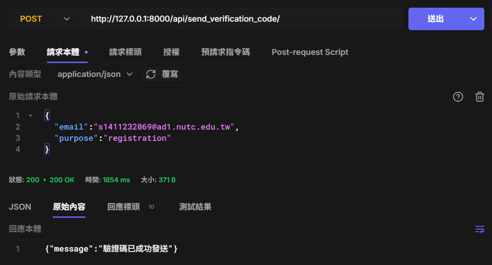
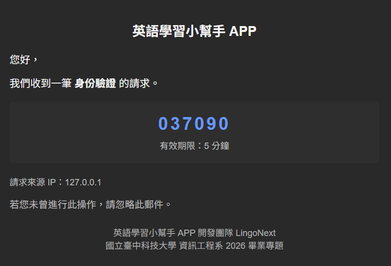

# Email Send Backend

> 此專案僅供學習參考用途，只做測試，無資料庫功能

Gmail SMTP 作為發驗證碼，因為模板化、高重複，可能直接進垃圾桶、直接拒信，甚至被封帳。改善方法是：
自己買 Domain，交給 Resend (專業寄信服務)來發送郵件。

## 實際信件流向

1. 使用者在前端輸入 email，點擊發送驗證碼
2. 前端呼叫後端 API，後端使用 Resend API 發送郵件
3. 使用者收到驗證碼，輸入驗證碼後前端呼叫後端 API 驗證驗證碼是否正確
4. 另外設置，當使用者回復郵件時，郵件會透過 Cloudflare Email Routing 自動轉寄至個人信箱，以便查看使用者回覆內容

## 安裝方式

### 1.下載專案

下載或 clone 此專案：

```bash
git clone https://github.com/LingoNext/email-send-backend.git
```

### 2.建立虛擬環境

建立並啟用 Python 虛擬環境：

```bash
# 建立虛擬環境
python -m venv venv
# 啟用虛擬環境
.\venv\Scripts\Activate.ps1
```

看到 `(venv)` 提示符即表示虛擬環境已啟用。

### 3.安裝相依套件

安裝所需的 Python 套件：

```bash
cd email_send_backend
pip install -r requirements.txt
```

### 4.設定環境變數

- SECRET_KEY: Django 專案的密鑰，可自訂
- SEND_EMAIL_API_KEY: 從 [resend](https://resend.com/) 申請 API Key

### 5.啟動服務

啟動 Django 開發服務器：

```bash
python manage.py runserver 0.0.0.0:8000
```

## API 端點

- `POST /api/send_verification_code/`: 發送驗證碼



## 測試郵件


