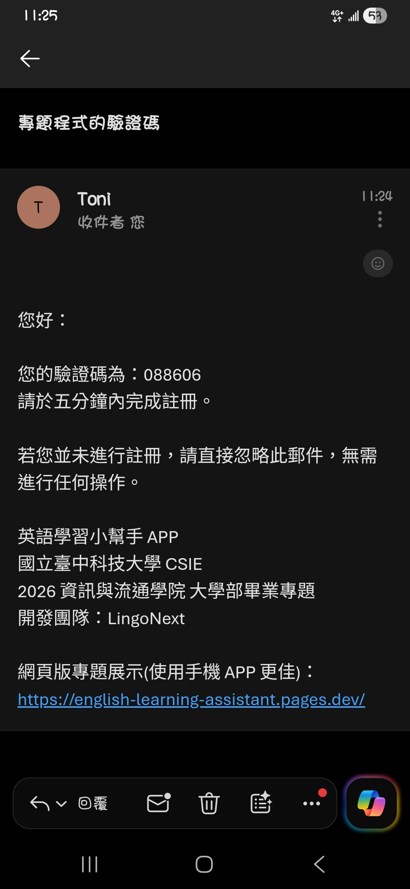

# Email Send Backend
> 此專案僅供學習參考用途
## 前提
SMTP + 自己的郵件服務商容易被擋信，Gmail 直接進垃圾桶 / 直接拒信 / 封帳。
自己買 domain(不要用免費的，幾乎都會被擋!) + API 寄信服務，使用 Resend 不是自己跑 SMTP，而是交給專業寄信服務來發送郵件。Cloudflare：負責「網域、DNS、保護、加速」；Resend：負責「寄信服務」。

## 技術棧
> 只做測試，無資料庫功能
- **後端框架**: Django
- **郵件服務**: Resend

## 安裝方式

### 1.下載專案

下載或 clone 此專案：

```bash
git clone https://github.com/LingoNext/email-send-backend.git
```

### 2.建立虛擬環境

建立並啟用 Python 虛擬環境：

```bash
# 建立虛擬環境
python -m venv venv
# 啟用虛擬環境
.\venv\Scripts\Activate.ps1
```

看到 `(venv)` 提示符即表示虛擬環境已啟用。

### 3.安裝相依套件

安裝所需的 Python 套件：

```bash
cd email_send_backend
pip install -r requirements.txt
```

### 4.設定環境變數

- SECRET_KEY: Django 專案的密鑰，可自訂
- SEND_EMAIL_API_KEY: 從 [resend](https://resend.com/) 申請 API Key

### 5.啟動服務

啟動 Django 開發服務器：
```bash
python manage.py runserver 0.0.0.0:8000
```


